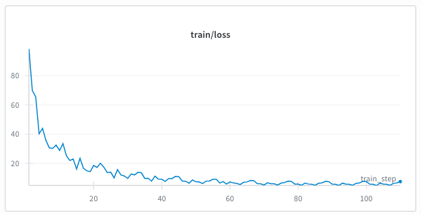
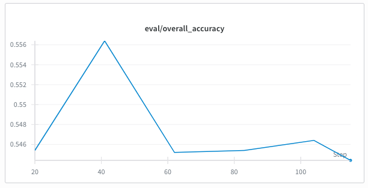
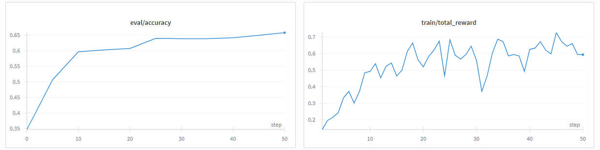

# MATH Dataset Post-training

Post-training experiments on the MATH dataset (Hendrycks et al.).

This is a from scratch implementation of a basic post-training pipeline. Everything from REINFORCE to GPU handling is written in-house. All work was done on two rented H100s.

## SFT Results

Supervised fine-tuning after data cleanse.

  
  

## GRPO Results (independent from SFT)

  

- Model is trained with GRPO.
- Accuracy reflects greedy eval on the 1024 validation set at checkpoints.
- See [GRPO Notes](grpo_notes.md): rough notes for my understanding.

### GRPO Run Parameters

- model_name: .models/Qwen2.5-Math-1.5B
- loss_type: grpo_clip
- learning_rate (lr): 1e-5
- lr_scheduler: cosine
- grad_clip: 1
- max_new_tokens: 1024
- group_size: 8
- rollout_batch_size: 256
- n_prompts_per_rollout_batch: 32
- micro_train_batch_size: 4
- gradient_accumulation_steps: 32
- n_microbatches_per_rollout_batch: 64
- n_grpo_steps: 50

